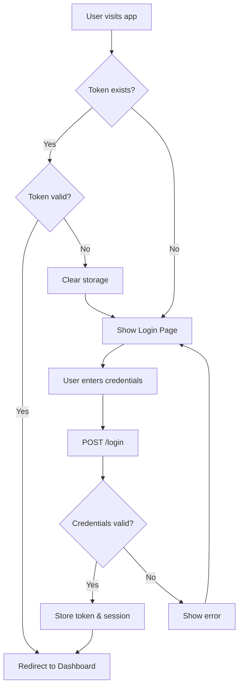
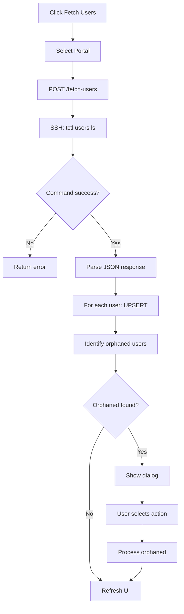
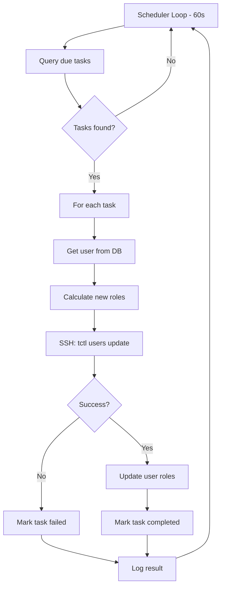

# Workflow Diagrams Document

## Overview

This document provides detailed workflow diagrams for all major processes in the Teleport User Management System. Diagrams are presented using Mermaid syntax for easy visualization.

---

## 1. Authentication Workflow

### Login Flow

```
┌─────────────────────────────────────────────────────────────────────────────┐
│                           LOGIN WORKFLOW                                     │
├─────────────────────────────────────────────────────────────────────────────┤
│                                                                             │
│   ┌─────────┐                                                               │
│   │  START  │                                                               │
│   └────┬────┘                                                               │
│        │                                                                    │
│        ▼                                                                    │
│   ┌─────────────────┐                                                       │
│   │  User visits    │                                                       │
│   │  application    │                                                       │
│   └────────┬────────┘                                                       │
│            │                                                                │
│            ▼                                                                │
│   ┌─────────────────┐     YES    ┌─────────────────┐                       │
│   │  Token exists   │───────────►│ Validate token  │                       │
│   │  in storage?    │            │ expiration      │                       │
│   └────────┬────────┘            └────────┬────────┘                       │
│            │ NO                           │                                 │
│            │                              ▼                                 │
│            │                     ┌─────────────────┐     YES               │
│            │                     │  Token valid?   │────────┐              │
│            │                     └────────┬────────┘        │              │
│            │                              │ NO              │              │
│            ▼                              ▼                 │              │
│   ┌─────────────────┐            ┌─────────────────┐        │              │
│   │  Show Login     │            │ Clear storage   │        │              │
│   │  Page           │◄───────────│ Show Login      │        │              │
│   └────────┬────────┘            └─────────────────┘        │              │
│            │                                                │              │
│            ▼                                                │              │
│   ┌─────────────────┐                                       │              │
│   │  User enters    │                                       │              │
│   │  credentials    │                                       │              │
│   └────────┬────────┘                                       │              │
│            │                                                │              │
│            ▼                                                │              │
│   ┌─────────────────┐                                       │              │
│   │  POST /login    │                                       │              │
│   │  API call       │                                       │              │
│   └────────┬────────┘                                       │              │
│            │                                                │              │
│            ▼                                                │              │
│   ┌─────────────────┐     NO     ┌─────────────────┐        │              │
│   │  Credentials    │───────────►│ Show error      │        │              │
│   │  valid?         │            │ message         │        │              │
│   └────────┬────────┘            └─────────────────┘        │              │
│            │ YES                                            │              │
│            ▼                                                │              │
│   ┌─────────────────┐                                       │              │
│   │  Store token &  │                                       │              │
│   │  session time   │                                       │              │
│   └────────┬────────┘                                       │              │
│            │                                                │              │
│            ▼                                                ▼              │
│   ┌─────────────────┐◄──────────────────────────────────────┘              │
│   │  Redirect to    │                                                      │
│   │  Dashboard      │                                                      │
│   └────────┬────────┘                                                      │
│            │                                                               │
│            ▼                                                               │
│   ┌─────────┐                                                              │
│   │   END   │                                                              │
│   └─────────┘                                                              │
│                                                                             │
└─────────────────────────────────────────────────────────────────────────────┘
```

### Session Management Flow

```
┌─────────────────────────────────────────────────────────────────────────────┐
│                      SESSION MANAGEMENT WORKFLOW                             │
├─────────────────────────────────────────────────────────────────────────────┤
│                                                                             │
│   ┌───────────────┐                                                         │
│   │ User Logged In│                                                         │
│   └───────┬───────┘                                                         │
│           │                                                                 │
│           ▼                                                                 │
│   ┌───────────────────────────────────────────────────────────────┐        │
│   │              INTERVAL CHECK (every 60 seconds)                 │        │
│   └───────────────────────────────────────────────────────────────┘        │
│           │                                                                 │
│           ▼                                                                 │
│   ┌─────────────────┐                                                       │
│   │ Calculate time  │                                                       │
│   │ remaining       │                                                       │
│   └────────┬────────┘                                                       │
│            │                                                                │
│            ├────────────── > 10 minutes remaining ──────────────┐          │
│            │                                                     │          │
│            │                                                     ▼          │
│            │                                            ┌──────────────┐   │
│            │                                            │ Continue     │   │
│            │                                            │ normal ops   │   │
│            │                                            └──────────────┘   │
│            │                                                               │
│            ├────────────── ≤ 10 minutes remaining ──────────────┐          │
│            │                                                     │          │
│            │                                                     ▼          │
│            │                                            ┌──────────────┐   │
│            │                                            │ Show warning │   │
│            │                                            │ dialog       │   │
│            │                                            └──────┬───────┘   │
│            │                                                   │           │
│            │                                                   ▼           │
│            │                                    ┌────────────────────────┐ │
│            │                                    │  User clicks          │ │
│            │                                    │  "Stay Logged In"?    │ │
│            │                                    └───────────┬───────────┘ │
│            │                                                │             │
│            │                              YES ──────────────┤             │
│            │                                                │             │
│            │                                                ▼             │
│            │                                    ┌──────────────────────┐  │
│            │                                    │ Reset session timer  │  │
│            │                                    │ (new 9-hour session) │  │
│            │                                    └──────────────────────┘  │
│            │                                                              │
│            │                              NO (or timeout) ───┐            │
│            │                                                 │            │
│            ├────────────── Session expired ─────────────────┐│            │
│            │                                                 ││            │
│            ▼                                                 ▼▼            │
│   ┌─────────────────┐                              ┌──────────────────┐   │
│   │ Clear token &   │◄─────────────────────────────│    Logout        │   │
│   │ redirect login  │                              └──────────────────┘   │
│   └─────────────────┘                                                      │
│                                                                             │
└─────────────────────────────────────────────────────────────────────────────┘
```

---

## 2. User Synchronization Workflow

### Portal Sync Process

```
┌─────────────────────────────────────────────────────────────────────────────┐
│                      USER SYNCHRONIZATION WORKFLOW                           │
├─────────────────────────────────────────────────────────────────────────────┤
│                                                                             │
│   ┌─────────┐                                                               │
│   │  START  │                                                               │
│   └────┬────┘                                                               │
│        │                                                                    │
│        ▼                                                                    │
│   ┌─────────────────────┐                                                   │
│   │ Admin clicks        │                                                   │
│   │ "Fetch Users"       │                                                   │
│   └──────────┬──────────┘                                                   │
│              │                                                              │
│              ▼                                                              │
│   ┌─────────────────────┐                                                   │
│   │ Select Portal       │                                                   │
│   │ (kocharsoft/igzy/   │                                                   │
│   │  maxicus)           │                                                   │
│   └──────────┬──────────┘                                                   │
│              │                                                              │
│              ▼                                                              │
│   ┌─────────────────────┐                                                   │
│   │ POST /fetch-users   │                                                   │
│   │ with portal param   │                                                   │
│   └──────────┬──────────┘                                                   │
│              │                                                              │
│              ▼                                                              │
│   ┌─────────────────────┐                                                   │
│   │ Backend establishes │                                                   │
│   │ SSH connection      │                                                   │
│   └──────────┬──────────┘                                                   │
│              │                                                              │
│              ▼                                                              │
│   ┌─────────────────────┐     FAIL    ┌─────────────────┐                  │
│   │ Execute:            │────────────►│ Return error    │                  │
│   │ tctl users ls       │             │ to frontend     │                  │
│   │ --format=json       │             └─────────────────┘                  │
│   └──────────┬──────────┘                                                   │
│              │ SUCCESS                                                      │
│              ▼                                                              │
│   ┌─────────────────────┐                                                   │
│   │ Parse JSON response │                                                   │
│   │ Extract user data   │                                                   │
│   └──────────┬──────────┘                                                   │
│              │                                                              │
│              ▼                                                              │
│   ┌─────────────────────┐                                                   │
│   │ FOR EACH user in    │                                                   │
│   │ response:           │                                                   │
│   │                     │                                                   │
│   │ ┌─────────────────┐ │                                                   │
│   │ │ Generate ID:    │ │                                                   │
│   │ │ {name}_{portal} │ │                                                   │
│   │ └────────┬────────┘ │                                                   │
│   │          │          │                                                   │
│   │          ▼          │                                                   │
│   │ ┌─────────────────┐ │                                                   │
│   │ │ User exists in  │ │                                                   │
│   │ │ database?       │ │                                                   │
│   │ └────────┬────────┘ │                                                   │
│   │    YES ──┴── NO     │                                                   │
│   │     │        │      │                                                   │
│   │     ▼        ▼      │                                                   │
│   │ ┌───────┐ ┌───────┐ │                                                   │
│   │ │UPDATE │ │INSERT │ │                                                   │
│   │ │roles, │ │new    │ │                                                   │
│   │ │status │ │user   │ │                                                   │
│   │ └───────┘ └───────┘ │                                                   │
│   │                     │                                                   │
│   └──────────┬──────────┘                                                   │
│              │                                                              │
│              ▼                                                              │
│   ┌─────────────────────┐                                                   │
│   │ Identify orphaned   │                                                   │
│   │ users (in DB but    │                                                   │
│   │ not in portal)      │                                                   │
│   └──────────┬──────────┘                                                   │
│              │                                                              │
│              ▼                                                              │
│   ┌─────────────────────┐     YES    ┌─────────────────────┐               │
│   │ Orphaned users      │───────────►│ Show Orphaned Users │               │
│   │ found?              │            │ Dialog              │               │
│   └──────────┬──────────┘            └──────────┬──────────┘               │
│              │ NO                               │                          │
│              │                                  ▼                          │
│              │                    ┌─────────────────────────┐              │
│              │                    │ User selects action:    │              │
│              │                    │ - Keep All (inactive)   │              │
│              │                    │ - Delete All            │              │
│              │                    │ - Selective             │              │
│              │                    └──────────┬──────────────┘              │
│              │                               │                             │
│              │                               ▼                             │
│              │                    ┌─────────────────────────┐              │
│              │                    │ Process orphaned users  │              │
│              │                    │ based on selection      │              │
│              │                    └──────────┬──────────────┘              │
│              │                               │                             │
│              ▼                               ▼                             │
│   ┌─────────────────────────────────────────────────────────┐              │
│   │                 Refresh UI with updated data             │              │
│   └──────────────────────────────┬──────────────────────────┘              │
│                                  │                                          │
│                                  ▼                                          │
│                            ┌─────────┐                                      │
│                            │   END   │                                      │
│                            └─────────┘                                      │
│                                                                             │
└─────────────────────────────────────────────────────────────────────────────┘
```

---

## 3. Role Change Workflow

### Immediate Role Change

```
┌─────────────────────────────────────────────────────────────────────────────┐
│                    IMMEDIATE ROLE CHANGE WORKFLOW                            │
├─────────────────────────────────────────────────────────────────────────────┤
│                                                                             │
│   ┌─────────┐                                                               │
│   │  START  │                                                               │
│   └────┬────┘                                                               │
│        │                                                                    │
│        ▼                                                                    │
│   ┌─────────────────────┐                                                   │
│   │ Admin selects user  │                                                   │
│   │ and roles to change │                                                   │
│   └──────────┬──────────┘                                                   │
│              │                                                              │
│              ▼                                                              │
│   ┌─────────────────────┐                                                   │
│   │ Select action:      │                                                   │
│   │ ADD or REMOVE roles │                                                   │
│   └──────────┬──────────┘                                                   │
│              │                                                              │
│              ▼                                                              │
│   ┌─────────────────────┐                                                   │
│   │ Click "Execute Now" │                                                   │
│   └──────────┬──────────┘                                                   │
│              │                                                              │
│              ▼                                                              │
│   ┌─────────────────────┐                                                   │
│   │ POST /execute-role- │                                                   │
│   │ change-immediate    │                                                   │
│   └──────────┬──────────┘                                                   │
│              │                                                              │
│              ▼                                                              │
│   ┌─────────────────────┐                                                   │
│   │ Fetch current user  │                                                   │
│   │ roles from database │                                                   │
│   └──────────┬──────────┘                                                   │
│              │                                                              │
│              ▼                                                              │
│   ┌─────────────────────┐                                                   │
│   │ Calculate new roles │                                                   │
│   │ based on action     │                                                   │
│   └──────────┬──────────┘                                                   │
│              │                                                              │
│              │         ADD                          REMOVE                  │
│              ├──────────────────────┬──────────────────────┐               │
│              │                      │                      │               │
│              ▼                      ▼                      │               │
│   ┌─────────────────────┐   ┌─────────────────────┐       │               │
│   │ new_roles =         │   │ new_roles =         │       │               │
│   │ current + selected  │   │ current - selected  │       │               │
│   │ (deduplicated)      │   │                     │       │               │
│   └──────────┬──────────┘   └──────────┬──────────┘       │               │
│              │                         │                   │               │
│              └────────────┬────────────┘                   │               │
│                           │                                │               │
│                           ▼                                │               │
│              ┌─────────────────────────┐                   │               │
│              │ SSH Command:            │                   │               │
│              │ tctl users update       │                   │               │
│              │ --set-roles {roles}     │                   │               │
│              │ {username}              │                   │               │
│              └──────────┬──────────────┘                   │               │
│                         │                                  │               │
│                         ▼                                  │               │
│              ┌─────────────────────────┐     FAIL         │               │
│              │ Command successful?     │─────────────────┐│               │
│              └──────────┬──────────────┘                 ││               │
│                         │ SUCCESS                        ││               │
│                         ▼                                ││               │
│              ┌─────────────────────────┐                 ││               │
│              │ Update user roles in DB │                 ││               │
│              └──────────┬──────────────┘                 ││               │
│                         │                                ││               │
│                         ▼                                ││               │
│              ┌─────────────────────────┐                 ││               │
│              │ Create completed task   │                 ││               │
│              │ record for audit        │                 ││               │
│              └──────────┬──────────────┘                 ││               │
│                         │                                ▼│               │
│                         ▼                    ┌─────────────────────┐      │
│              ┌─────────────────────────┐     │ Return error        │      │
│              │ Return success response │     │ to frontend         │      │
│              └──────────┬──────────────┘     └─────────────────────┘      │
│                         │                                                  │
│                         ▼                                                  │
│                   ┌─────────┐                                              │
│                   │   END   │                                              │
│                   └─────────┘                                              │
│                                                                             │
└─────────────────────────────────────────────────────────────────────────────┘
```

### Scheduled Role Change

```
┌─────────────────────────────────────────────────────────────────────────────┐
│                     SCHEDULED ROLE CHANGE WORKFLOW                           │
├─────────────────────────────────────────────────────────────────────────────┤
│                                                                             │
│   SCHEDULING PHASE                                                          │
│   ════════════════                                                          │
│                                                                             │
│   ┌─────────┐                                                               │
│   │  START  │                                                               │
│   └────┬────┘                                                               │
│        │                                                                    │
│        ▼                                                                    │
│   ┌─────────────────────┐                                                   │
│   │ Admin configures:   │                                                   │
│   │ - User              │                                                   │
│   │ - Action (add/rem)  │                                                   │
│   │ - Roles             │                                                   │
│   │ - Date/Time         │                                                   │
│   └──────────┬──────────┘                                                   │
│              │                                                              │
│              ▼                                                              │
│   ┌─────────────────────┐                                                   │
│   │ Click "Schedule"    │                                                   │
│   └──────────┬──────────┘                                                   │
│              │                                                              │
│              ▼                                                              │
│   ┌─────────────────────┐                                                   │
│   │ POST /schedule-     │                                                   │
│   │ role-change         │                                                   │
│   └──────────┬──────────┘                                                   │
│              │                                                              │
│              ▼                                                              │
│   ┌─────────────────────┐                                                   │
│   │ Create ScheduledTask│                                                   │
│   │ record in database  │                                                   │
│   │ status = 'scheduled'│                                                   │
│   └──────────┬──────────┘                                                   │
│              │                                                              │
│              ▼                                                              │
│   ┌─────────────────────┐                                                   │
│   │ Return success with │                                                   │
│   │ task_id             │                                                   │
│   └──────────┬──────────┘                                                   │
│              │                                                              │
│              ▼                                                              │
│   ┌─────────────────────┐                                                   │
│   │ Task visible in     │                                                   │
│   │ Scheduled Jobs page │                                                   │
│   └─────────────────────┘                                                   │
│                                                                             │
│                                                                             │
│   EXECUTION PHASE (Background Scheduler)                                    │
│   ══════════════════════════════════════                                    │
│                                                                             │
│   ┌─────────────────────────────────────────────────────────────────────┐  │
│   │                   SCHEDULER LOOP (every 60 seconds)                  │  │
│   └────────────────────────────────────┬────────────────────────────────┘  │
│                                        │                                    │
│                                        ▼                                    │
│                           ┌─────────────────────────┐                      │
│                           │ Query: scheduled_tasks  │                      │
│                           │ WHERE status='scheduled'│                      │
│                           │ AND scheduled_time<=NOW │                      │
│                           └──────────┬──────────────┘                      │
│                                      │                                      │
│                                      ▼                                      │
│                           ┌─────────────────────────┐   NO                 │
│                           │ Tasks found?            │───────► (wait 60s)   │
│                           └──────────┬──────────────┘                      │
│                                      │ YES                                  │
│                                      ▼                                      │
│                           ┌─────────────────────────┐                      │
│                           │ FOR EACH task:          │                      │
│                           │                         │                      │
│                           │ 1. Get user from DB     │                      │
│                           │ 2. Calculate new roles  │                      │
│                           │ 3. Execute SSH command  │                      │
│                           │ 4. Update user in DB    │                      │
│                           │ 5. Update task status   │                      │
│                           │    - completed/failed   │                      │
│                           │    - executed_at        │                      │
│                           │    - result             │                      │
│                           │                         │                      │
│                           └──────────┬──────────────┘                      │
│                                      │                                      │
│                                      ▼                                      │
│                           ┌─────────────────────────┐                      │
│                           │ Log execution results   │                      │
│                           └──────────┬──────────────┘                      │
│                                      │                                      │
│                                      ▼                                      │
│                              (continue loop)                                │
│                                                                             │
└─────────────────────────────────────────────────────────────────────────────┘
```

---

## 4. User Search & Filter Workflow

```
┌─────────────────────────────────────────────────────────────────────────────┐
│                      USER SEARCH & FILTER WORKFLOW                           │
├─────────────────────────────────────────────────────────────────────────────┤
│                                                                             │
│   ┌─────────────────────────────────────────────────────────────────────┐  │
│   │                     INITIAL DATA LOAD                                │  │
│   └─────────────────────────────────────────────────────────────────────┘  │
│                                        │                                    │
│                                        ▼                                    │
│                           ┌─────────────────────────┐                      │
│                           │ GET /api/users          │                      │
│                           │ Fetch ALL users         │                      │
│                           └──────────┬──────────────┘                      │
│                                      │                                      │
│                                      ▼                                      │
│                           ┌─────────────────────────┐                      │
│                           │ Store in React Query    │                      │
│                           │ cache                   │                      │
│                           └──────────┬──────────────┘                      │
│                                      │                                      │
│   ┌──────────────────────────────────┼──────────────────────────────────┐  │
│   │                     CLIENT-SIDE FILTERING                            │  │
│   └──────────────────────────────────┼──────────────────────────────────┘  │
│                                      │                                      │
│                                      ▼                                      │
│   ┌─────────────────────────────────────────────────────────────────────┐  │
│   │                                                                      │  │
│   │   ┌───────────────┐   ┌───────────────┐   ┌───────────────┐        │  │
│   │   │ Search Term   │   │ Portal Filter │   │ Manager Filter│        │  │
│   │   │ Input         │   │ Dropdown      │   │ Dropdown      │        │  │
│   │   └───────┬───────┘   └───────┬───────┘   └───────┬───────┘        │  │
│   │           │                   │                   │                 │  │
│   │           └───────────────────┼───────────────────┘                 │  │
│   │                               │                                     │  │
│   │                               ▼                                     │  │
│   │   ┌───────────────────────────────────────────────────────────┐    │  │
│   │   │              FILTER LOGIC (runs on change)                 │    │  │
│   │   │                                                            │    │  │
│   │   │  filteredUsers = allUsers.filter(user => {                │    │  │
│   │   │                                                            │    │  │
│   │   │    // Search match (name, roles, manager)                  │    │  │
│   │   │    const matchesSearch = user.name.includes(searchTerm)   │    │  │
│   │   │      || user.roles.some(r => r.includes(searchTerm))      │    │  │
│   │   │      || user.manager?.includes(searchTerm);               │    │  │
│   │   │                                                            │    │  │
│   │   │    // Portal filter                                        │    │  │
│   │   │    const matchesPortal = !selectedPortal                   │    │  │
│   │   │      || user.portal === selectedPortal;                    │    │  │
│   │   │                                                            │    │  │
│   │   │    // Manager filter                                       │    │  │
│   │   │    const matchesManager = !selectedManager                 │    │  │
│   │   │      || user.manager === selectedManager;                  │    │  │
│   │   │                                                            │    │  │
│   │   │    // Role inclusion/exclusion                             │    │  │
│   │   │    const hasExcludedRole = user.roles                      │    │  │
│   │   │      .some(r => excludedRoles.includes(r));                │    │  │
│   │   │    const hasIncludedRole = includedRoles.length === 0      │    │  │
│   │   │      || user.roles.some(r => includedRoles.includes(r));   │    │  │
│   │   │                                                            │    │  │
│   │   │    return matchesSearch && matchesPortal                   │    │  │
│   │   │      && matchesManager && !hasExcludedRole                 │    │  │
│   │   │      && hasIncludedRole;                                   │    │  │
│   │   │  });                                                       │    │  │
│   │   │                                                            │    │  │
│   │   └───────────────────────────────────────────────────────────┘    │  │
│   │                               │                                     │  │
│   │                               ▼                                     │  │
│   │                  ┌─────────────────────────┐                       │  │
│   │                  │ Render filtered users   │                       │  │
│   │                  │ (Card or Table view)    │                       │  │
│   │                  └─────────────────────────┘                       │  │
│   │                                                                      │  │
│   └──────────────────────────────────────────────────────────────────────┘  │
│                                                                             │
└─────────────────────────────────────────────────────────────────────────────┘
```

---

## 5. Data Export Workflow

```
┌─────────────────────────────────────────────────────────────────────────────┐
│                         CSV EXPORT WORKFLOW                                  │
├─────────────────────────────────────────────────────────────────────────────┤
│                                                                             │
│   ┌─────────┐                                                               │
│   │  START  │                                                               │
│   └────┬────┘                                                               │
│        │                                                                    │
│        ▼                                                                    │
│   ┌─────────────────────┐                                                   │
│   │ Admin clicks        │                                                   │
│   │ "Export CSV"        │                                                   │
│   └──────────┬──────────┘                                                   │
│              │                                                              │
│              ▼                                                              │
│   ┌─────────────────────┐     NO     ┌─────────────────────┐               │
│   │ Users data          │───────────►│ Show error toast    │               │
│   │ available?          │            │ "No data available" │               │
│   └──────────┬──────────┘            └─────────────────────┘               │
│              │ YES                                                          │
│              ▼                                                              │
│   ┌─────────────────────┐                                                   │
│   │ Generate CSV headers│                                                   │
│   │ ID, Name, Roles,    │                                                   │
│   │ Status, Created,    │                                                   │
│   │ Last Login, Manager,│                                                   │
│   │ Portal              │                                                   │
│   └──────────┬──────────┘                                                   │
│              │                                                              │
│              ▼                                                              │
│   ┌─────────────────────┐                                                   │
│   │ FOR EACH user:      │                                                   │
│   │ - Format fields     │                                                   │
│   │ - Escape quotes     │                                                   │
│   │ - Join with commas  │                                                   │
│   └──────────┬──────────┘                                                   │
│              │                                                              │
│              ▼                                                              │
│   ┌─────────────────────┐                                                   │
│   │ Create Blob from    │                                                   │
│   │ CSV content         │                                                   │
│   └──────────┬──────────┘                                                   │
│              │                                                              │
│              ▼                                                              │
│   ┌─────────────────────┐                                                   │
│   │ Create download link│                                                   │
│   │ Filename:           │                                                   │
│   │ all_users_YYYY-MM-  │                                                   │
│   │ DD.csv              │                                                   │
│   └──────────┬──────────┘                                                   │
│              │                                                              │
│              ▼                                                              │
│   ┌─────────────────────┐                                                   │
│   │ Trigger browser     │                                                   │
│   │ download            │                                                   │
│   └──────────┬──────────┘                                                   │
│              │                                                              │
│              ▼                                                              │
│   ┌─────────────────────┐                                                   │
│   │ Show success toast  │                                                   │
│   │ "X users exported"  │                                                   │
│   └──────────┬──────────┘                                                   │
│              │                                                              │
│              ▼                                                              │
│        ┌─────────┐                                                          │
│        │   END   │                                                          │
│        └─────────┘                                                          │
│                                                                             │
└─────────────────────────────────────────────────────────────────────────────┘
```

---

## 6. Error Handling Workflow

```
┌─────────────────────────────────────────────────────────────────────────────┐
│                         ERROR HANDLING WORKFLOW                              │
├─────────────────────────────────────────────────────────────────────────────┤
│                                                                             │
│   ┌───────────────────────────────────────────────────────────────────┐    │
│   │                        API REQUEST                                 │    │
│   └───────────────────────────────┬───────────────────────────────────┘    │
│                                   │                                         │
│                                   ▼                                         │
│                    ┌─────────────────────────────┐                         │
│                    │    Check Response Status    │                         │
│                    └──────────────┬──────────────┘                         │
│                                   │                                         │
│          ┌────────────────────────┼────────────────────────┐               │
│          │                        │                        │               │
│          ▼                        ▼                        ▼               │
│   ┌─────────────┐          ┌─────────────┐          ┌─────────────┐       │
│   │   200 OK    │          │ 403 Forbidden│          │ 500 Server  │       │
│   │             │          │             │          │   Error     │       │
│   └──────┬──────┘          └──────┬──────┘          └──────┬──────┘       │
│          │                        │                        │               │
│          ▼                        ▼                        ▼               │
│   ┌─────────────┐          ┌─────────────┐          ┌─────────────┐       │
│   │ Process     │          │ Check error │          │ Show error  │       │
│   │ response    │          │ message     │          │ toast       │       │
│   └─────────────┘          └──────┬──────┘          └─────────────┘       │
│                                   │                                         │
│                    ┌──────────────┴──────────────┐                         │
│                    │                             │                         │
│                    ▼                             ▼                         │
│          ┌─────────────────┐          ┌─────────────────┐                  │
│          │ "Token expired" │          │  Other 403      │                  │
│          │                 │          │                 │                  │
│          └────────┬────────┘          └────────┬────────┘                  │
│                   │                            │                            │
│                   ▼                            ▼                            │
│          ┌─────────────────┐          ┌─────────────────┐                  │
│          │ Clear token     │          │ Show auth error │                  │
│          │ from storage    │          │ toast           │                  │
│          └────────┬────────┘          └─────────────────┘                  │
│                   │                                                         │
│                   ▼                                                         │
│          ┌─────────────────┐                                               │
│          │ Redirect to     │                                               │
│          │ login page      │                                               │
│          └─────────────────┘                                               │
│                                                                             │
└─────────────────────────────────────────────────────────────────────────────┘
```

---

## Mermaid Diagram Examples

For tools that support Mermaid rendering, here are the same workflows:

### Authentication Flow (Mermaid)



### User Sync Flow (Mermaid)



### Scheduler Flow (Mermaid)


